# Getting Started with Research Analytics Suite

This tutorial will guide you through the basic workflow of the Research Analytics Suite (RAS). By the end, you'll understand how to import data, run operations, and visualize your results.

## Overview

Working with RAS follows a straightforward workflow:

1. **Import Data** - Load your data into Memory Slots
2. **Select an Operation** - Choose from the Operation Library
3. **Configure & Execute** - Assign data inputs and run the operation
4. **View Results** - Monitor progress and examine outputs
5. **Visualize & Export** - Create charts and export your results

## Main Window Layout

When you launch RAS, you'll see the main window divided into several key areas:

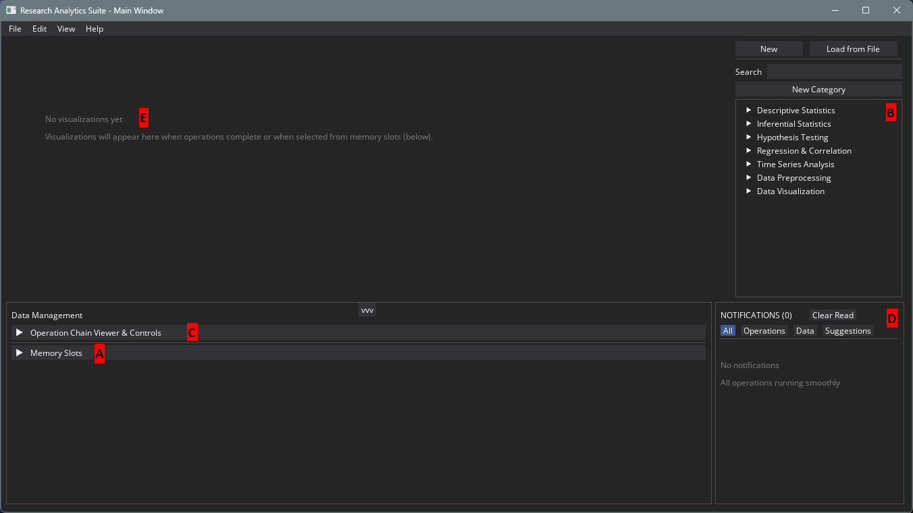

| Region | Purpose |
|--------|---------|
| **A - Memory Slots** | Store and manage your data variables |
| **B - Operation Library** | Browse and select operations to run |
| **C - Operation Chain Viewer & Controls** | Configure and execute operations |
| **D - Notifications** | Monitor progress and view results |
| **E - Visualization Workspace** | Display charts and data visualizations |

---

## A. Data Import & Management

Before running any analysis, you need to load your data into RAS. There are two ways to do this:

### Option 1: Add a Slot Manually

Use this method to create variables with simple values (numbers, text, lists, etc.).

1. Expand the **Memory Slots** panel in the Data Management section
2. Click the **+ Add Slot** button

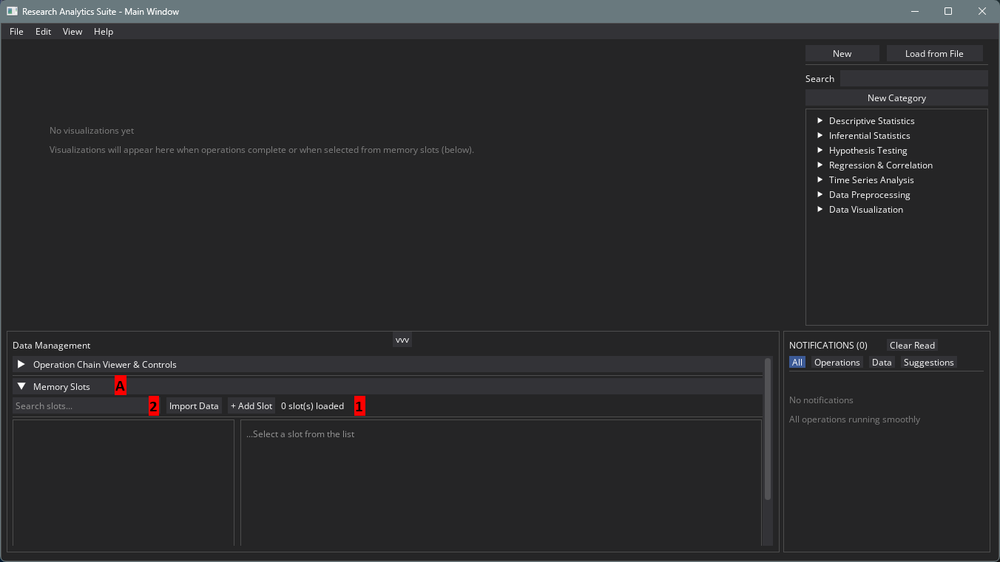

3. In the Add Memory Slot dialog:
   - Enter a **name** for your variable
   - Select the **data type** (int, float, str, list, dict, set, bool)
   - Enter the **value**

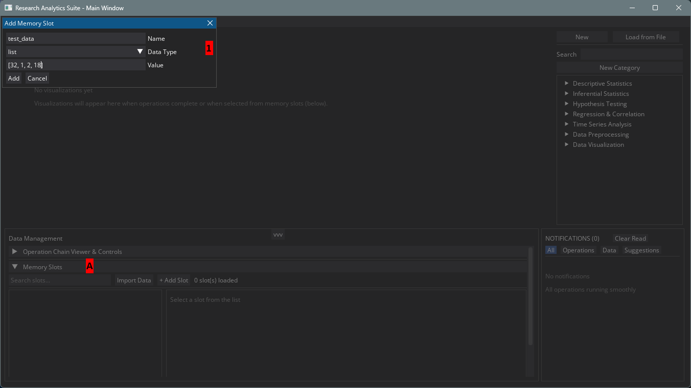

### Option 2: Import Data from File

Use this method to load data from CSV, JSON, or other supported file formats.

1. Click the **Import Data** button
2. Select your file from the file browser
3. Configure any import options as needed

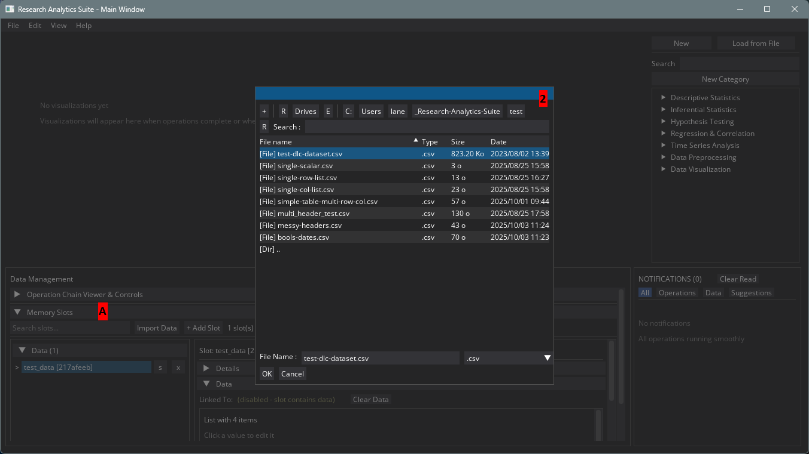

### Viewing Your Data

After adding or importing data, your Memory Slots will be populated. Click on any slot to view, modify, or export its contents.

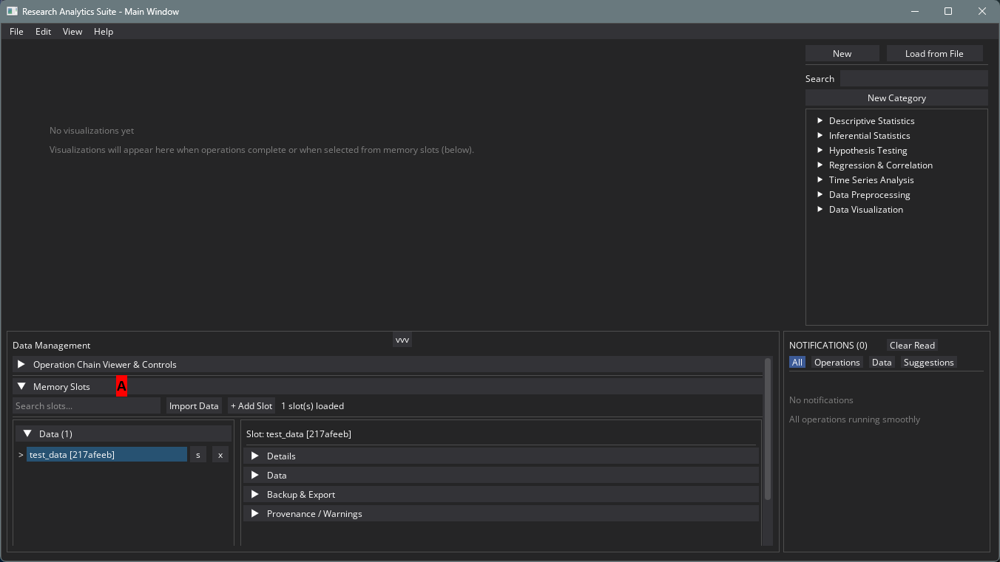

---

## B. Operation Selection

RAS provides a library of pre-built operations organized by category. Browse the Operation Library on the right side of the window.

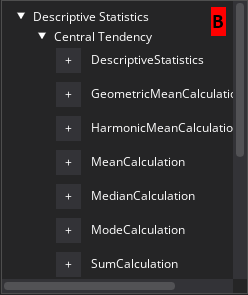

**Available Categories:**
- Descriptive Statistics
- Inferential Statistics
- Hypothesis Testing
- Regression & Correlation
- Time Series Analysis
- Data Preprocessing
- Data Visualization

To add an operation, expand a category and click the **+** button next to the operation you want to use.

---

## C. Operation Control & Settings

Once you've selected an operation, it appears in the **Operation Chain Viewer & Controls** panel.

### 1. View Operation Details

Click the **Details** button next to your operation to see its configuration options.

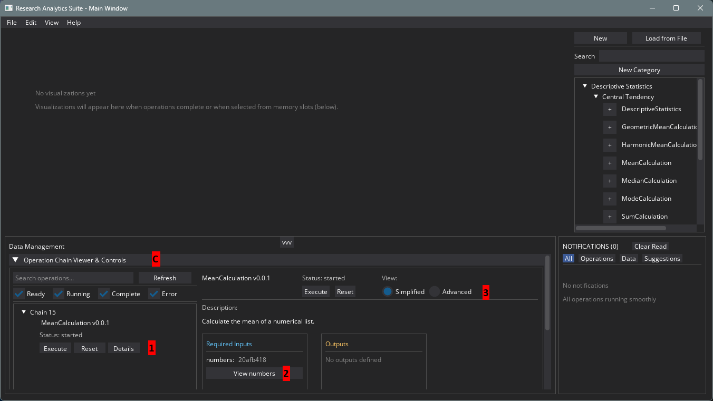

The details panel shows:
- **Description** - What the operation does
- **Required Inputs** - Data the operation needs
- **Outputs** - What the operation produces
- **Execute/Reset** buttons - Run or reset the operation

### 2. Assign Memory Slots to Inputs

Connect your data to the operation:

1. Find the **Required Inputs** section
2. Use the **Linked To** dropdown to select a Memory Slot
3. This associates your data with the operation's input

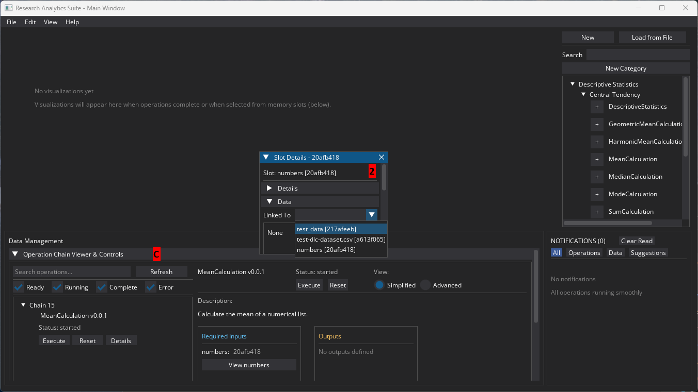

### 3. Execute the Operation

Once your inputs are configured, click the **Execute** button to run the operation.

### 4. Simplified vs Advanced View

Toggle between **Simplified** and **Advanced** views using the radio buttons at the top of the details panel.

- **Simplified** - Shows basic configuration options
- **Advanced** - Reveals additional tabs and functionality

### 5. Advanced: Code Modification

In Advanced view, the **Code & Execution** tab displays the operation's action code. You can:

- View the underlying Python code
- Modify the code for custom behavior
- Click **Save Action Code** to apply your changes

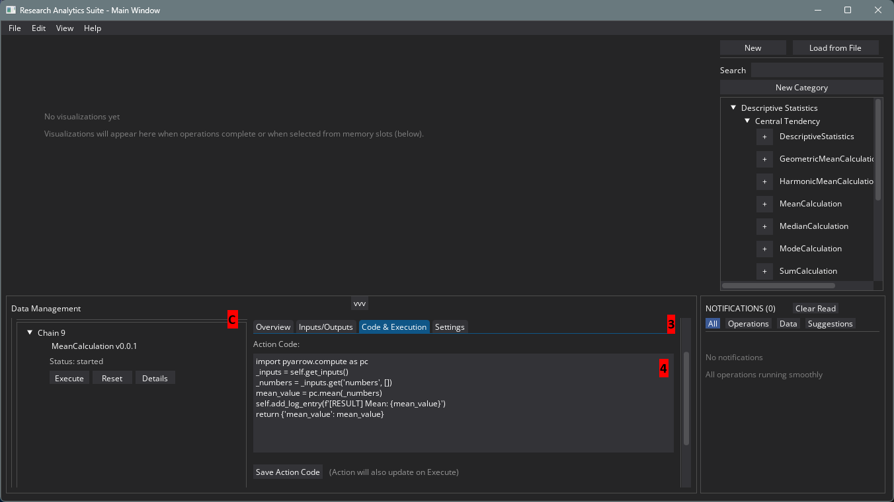

> **Note:** Always save your code changes before executing, or the original code will run.

---

## D. Notifications & Monitoring Progress

After executing an operation, results appear in the **Notifications** panel.

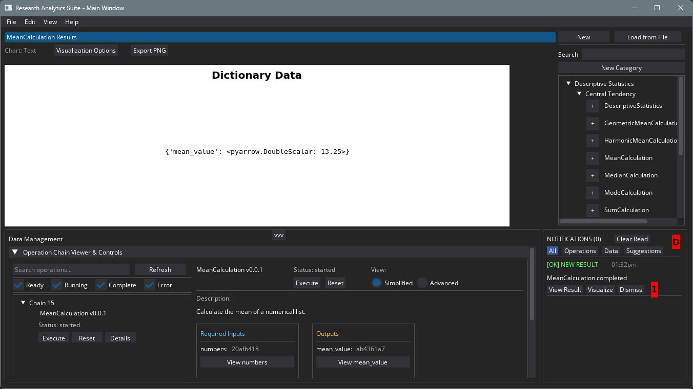

Each notification offers two options:

- **View Result** - Opens a dialog showing the operation's output data
- **Visualize** - Creates a visualization of the results

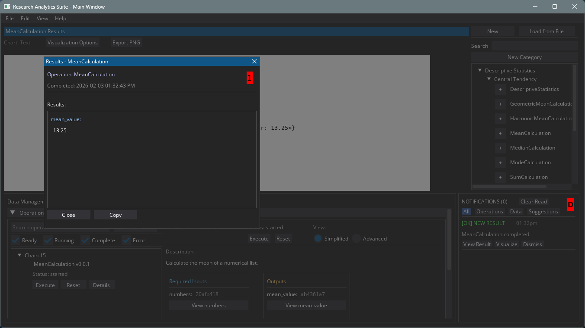

Operation results are also automatically saved to Memory Slots, making them available for further analysis.

---

## E. Visualizing & Exporting Results

RAS provides interactive data visualization capabilities.

### Creating Visualizations

Visualizations appear in the main workspace area. They are created automatically when:
- You click **Visualize** on a notification
- You select a Memory Slot containing visualizable data

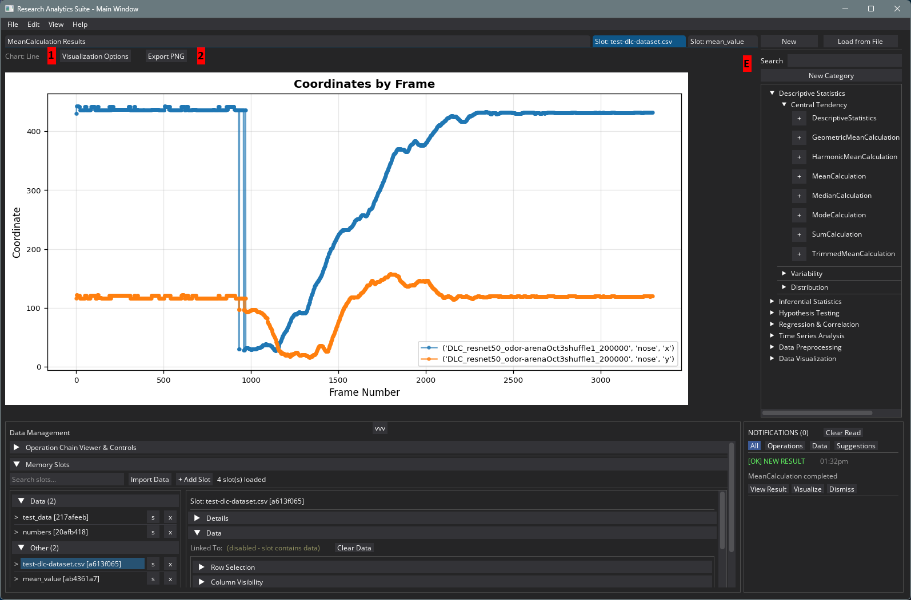

### Visualization Options

Click **Visualization Options** to customize your chart:

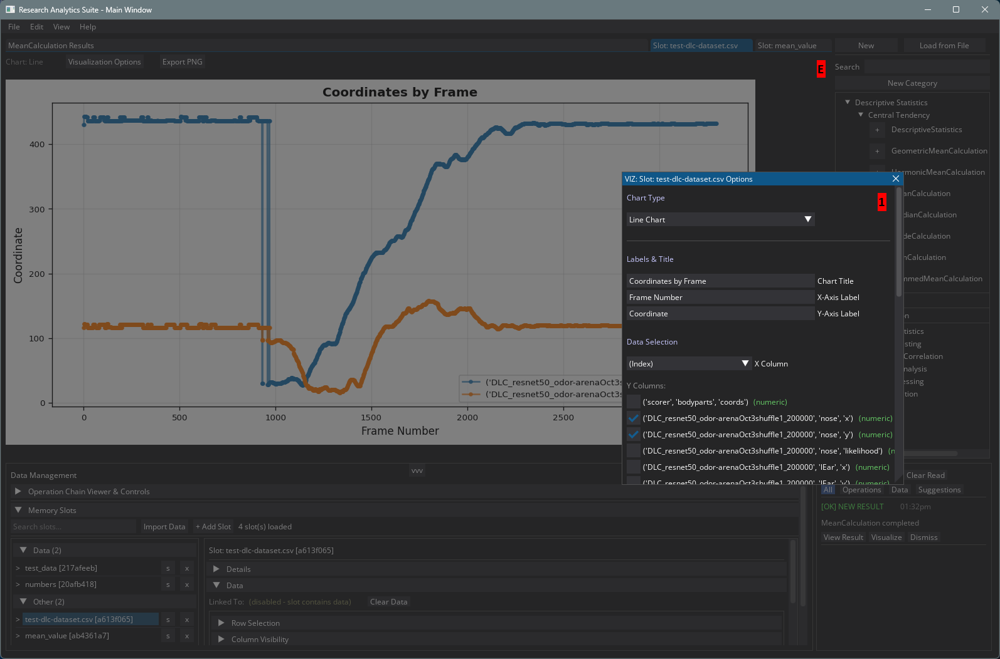

Available customizations:
- **Chart Type** - Line, bar, scatter, histogram, etc.
- **Title** - Chart title text
- **Labels** - Axis labels and legend
- **Data Selection** - Choose specific columns or series to display

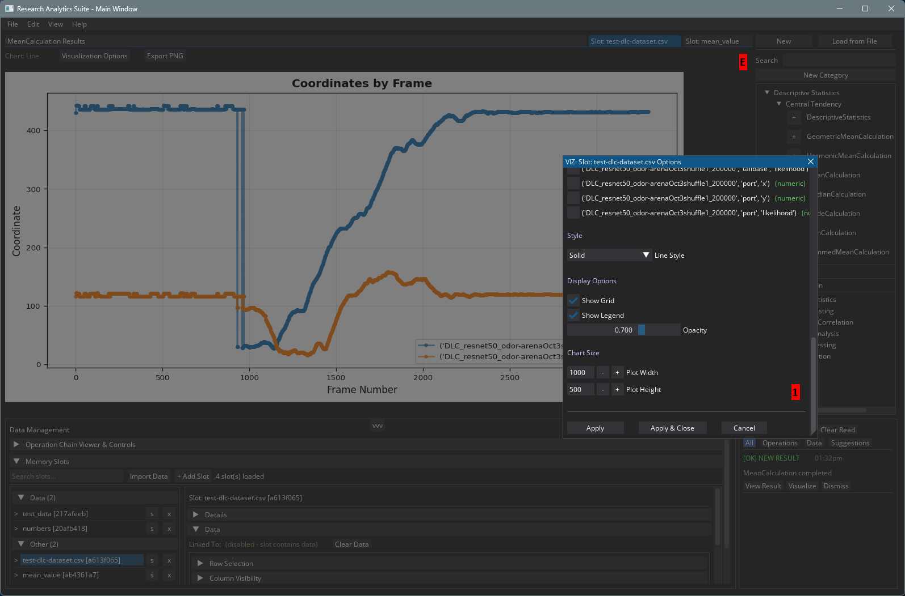

### Exporting Results

#### Export Chart as PNG

Click the **Export PNG** button above your visualization to save it as an image file.

#### Export Data from Memory Slots

1. Select a Memory Slot
2. Navigate to the **Backup & Export** tab
3. Choose your export format (CSV, JSON, etc.)

#### Finding Exported Files

All exported files are saved to the **exports** folder within your current workspace directory.

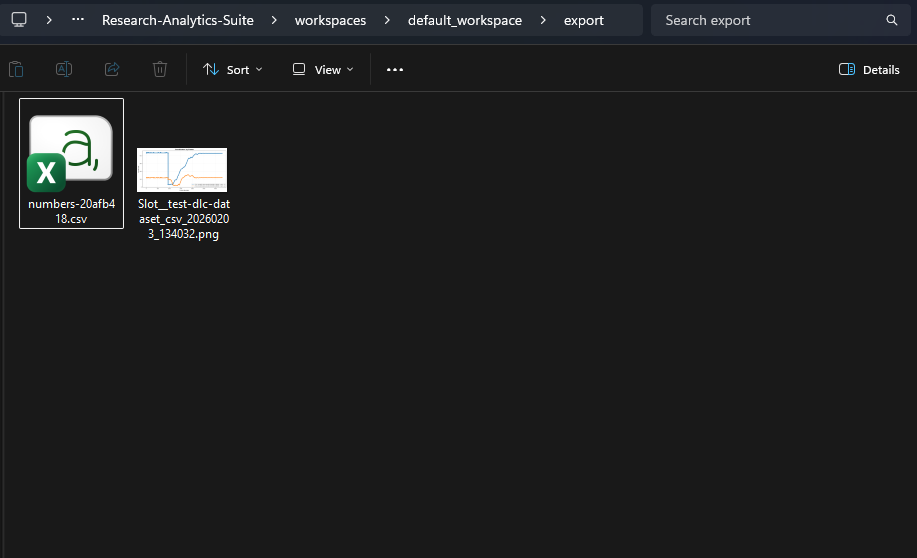

---

## Quick Reference

| Task | How To |
|------|--------|
| Add data manually | Memory Slots > + Add Slot |
| Import from file | Memory Slots > Import Data |
| Run an operation | Select operation > Assign inputs > Execute |
| View results | Notifications > View Result |
| Create chart | Notifications > Visualize, or select Memory Slot |
| Export chart | Visualization > Export PNG |
| Export data | Memory Slot > Backup & Export tab |
