# Getting Started Tutorial: Mouse Olfaction Tracking with DeepLabCut Data

> **Dataset**: Tariq et al. (2024)[^1] — Mouse olfaction arena, DeepLabCut[^2] pose estimation

> **RAS version**: 0.0.1 · **Estimated time**: 45-60 minutes

---

## Introduction

This tutorial walks through the process of loading, inspecting, cleaning, analyzing, and visualizing a sample dataset of mouse head tracking data (Tariq et al., 2024)[^1] obtained from DeepLabCut (DLC)[^2]. The dataset captures the x and y pixel coordinates of the mouse's nose and other body parts as it explores an arena with an odor source. By following this tutorial, you will learn how to use RAS to extract insights about the mouse's behavior from DLC data.

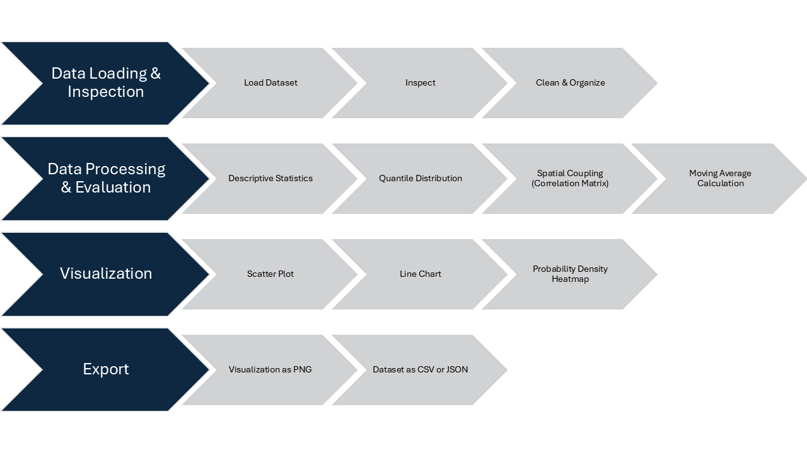

### What is DeepLabCut (DLC) data?

DeepLabCut[^2] (DLC) is a markerless pose estimation toolkit for neuroscience. It tracks the (x, y) pixel coordinates of user-defined **body parts** across video frames, together with a **likelihood** score (0–1) indicating how confident the model is about each detection.

### What is this dataset?

The sample dataset comes from **Tariq et al. (2024)**[^1], a mouse olfaction study in which mice explore an open arena with an odor port. DLC[^2] tracked **7 body parts**:

| Body Part  | Description                                |
|------------|--------------------------------------------|
| `nose`     | Tip of snout — primary odor-sampling organ |
| `lEar`     | Left ear                                   |
| `rEar`     | Right ear                                  |
| `neck`     | Base of neck                               |
| `body`     | Center of body mass                        |
| `tailbase` | Base of tail                               |
| `port`     | Odor port fixture (static reference)       |

Each body part has three columns: `<part>_x`, `<part>_y`, and `<part>_likelihood`.

### Column naming

The CSV uses a multi-level header (DLC[^2] default). After loading into RAS, columns appear as:

```
bodyparts  nose       nose       nose       lEar  ...
coords     x          y          likelihood x     ...
```

RAS flattens these into readable names like `nose_x`, `nose_y`, `nose_likelihood`, etc.

---

## Load the Sample Dataset

RAS ships with a one-click sample import.

1. Open the **File** menu in the top menu bar.
2. Hover over **Load Sample Dataset**.
3. Click **DLC Olfaction Demo**.

   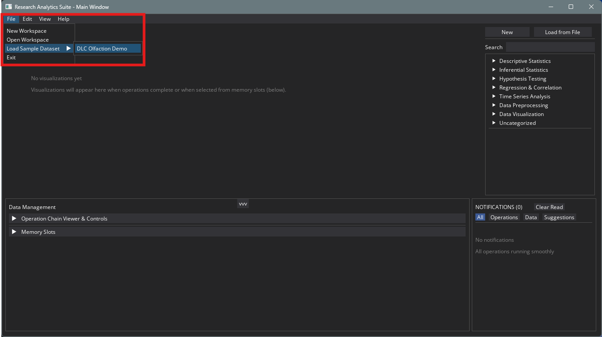

RAS will parse the CSV and create a memory slot named **`dlc_sample`** in the Data Management panel at the bottom of the screen.

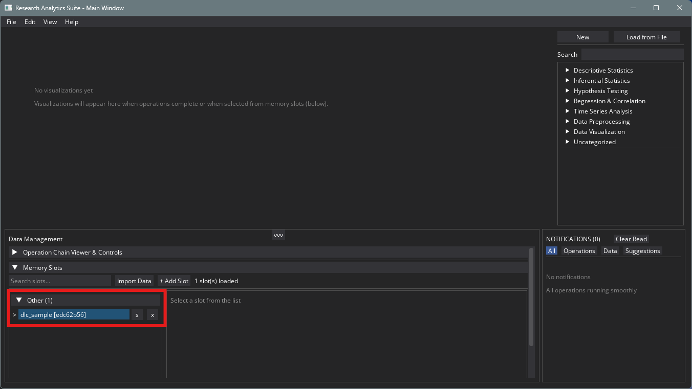

> **What just happened?** RAS called `Workspace.load_data()` on the CSV, profiled its schema, and stored the result in a `MemorySlot`. You can inspect, process, and visualize it from here.

> After completing this tutorial, you can load your own data using the `Import Data` button in the `Memory Slot` panel depicted above. 

---

## Inspect the Data

Click the **`dlc_sample`** row in the slot list to open the inspector panel on the right.

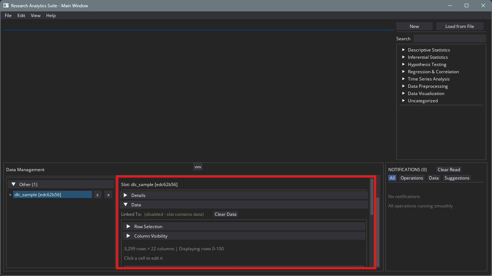

You will see:

| Field            | Description / Expected Data                                            |
|------------------|------------------------------------------------------------------------|
| **Row count**    | the number of video frames in this recording (3,299 rows)              |
| **Column list**  | 21 columns total (3 per body part × 7 body parts)                      |
| **Data preview** | first few rows with `nose_x`, `nose_y`, `nose_likelihood`, `lEar_x`, … |

---

## Clean & Organize the Data

### Run the Data Cleaning operation

DLC[^2] frames with low likelihood are unreliable. Let's filter them out before analysis:

1. In the **Memory Slots** panel, select the **`s`** (subset) button next to `dlc_sample` to open the subset window.
   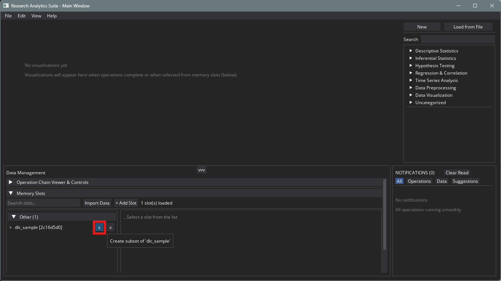
2. In the subset window, there is a region titled **`Keep rows where`**, which allows you to apply a filter to the data. This is where you can specify the likelihood threshold.
3. Select the dropdown `-- none --` and choose `('DLC_resnet50_odor-arenaOct3shuffle1_200000', 'nose', 'likelihood')` to specify the column to filter on.
4. Select the operator `>` and enter `0.9` as the threshold value. 
    > This will keep only rows where the nose likelihood is greater than `0.9`.
5. Select the `Create Subset` button to perform the filtering operation.

   > For this tutorial, we are performing the filter solely on the `nose likelihood` column, but you can apply similar filters to any body part or likelihood column, as needed.

   > **Tip**: You can additionally add more conditions by clicking the `+ Add Condition` button, allowing you to create complex filters (e.g., keep rows where `nose likelihood > 0.6` AND `lEar likelihood > 0.5`).

   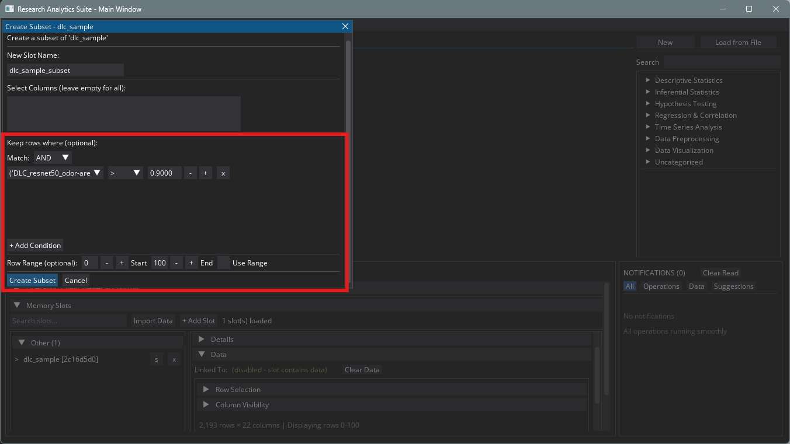

6. After selecting `Create Subset`, a new slot **`dlc_sample_subset`** appears in the Data Management panel. Select it to confirm the row count has decreased to `2,193 rows`; frames where `nose_likelihood > 0.9` have been retained.

   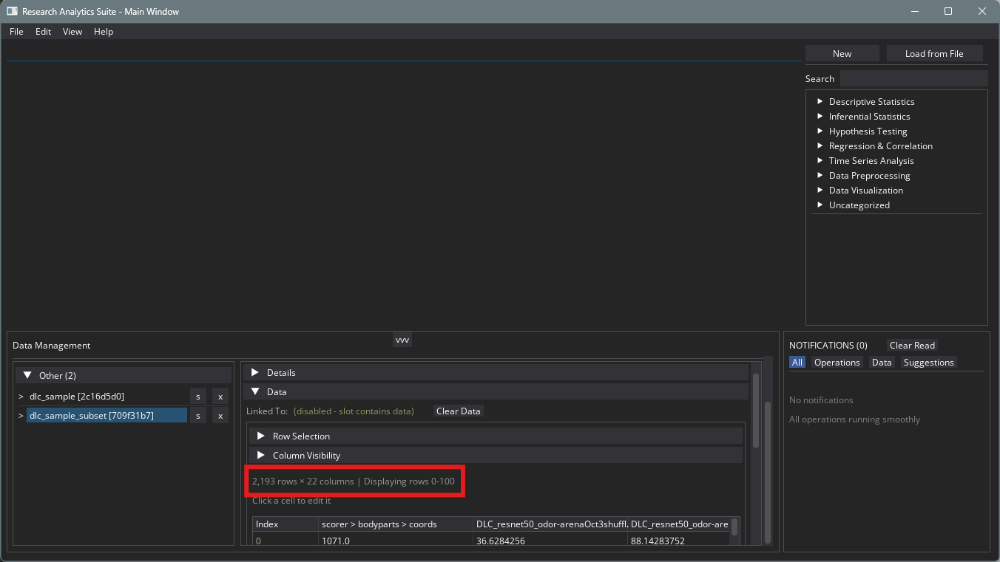

---

## Process & Evaluate the Data

With the cleaned `dlc_sample_subset` in hand (2,193 frames, nose likelihood > 0.9), we can run statistical and signal-processing operations to characterize the mouse's movement before visualizing it. Operations are accessed through the **Operation Library** panel on the right-hand side of the screen.

The following sections demonstrate how to apply various operations to the `dlc_sample_subset` data. Each operation will generate new variables that are stored in the `Memory Slots` region of the `Data Management` panel, which can be used for further analysis or visualization (discussed in the next section).

---

### Descriptive Statistics of Nose Position

The first step in any analysis is understanding the basic properties of your data. Running **Descriptive Statistics** on the nose x-coordinate reveals the spatial range and central tendency of the mouse's head position across the filtered recording.

1. In the Operation Library, locate and select `Descriptive Statistics`, then `Central Tendency`, and finally the `+` button next to `DescriptiveStatistics`. This loads the operation into the `Operation Chain Viewer & Controls` panel.
2. Select the `Details` button to open the operation configuration panel. The module contains all settings, parameters, and Action Code for the selected operation. 

   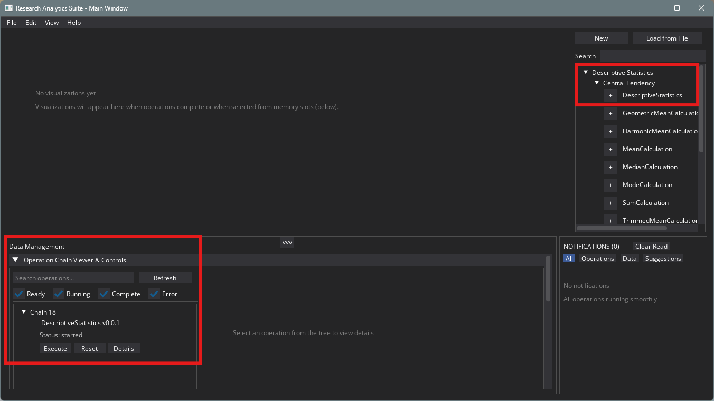

3. The `Required Inputs` region (below `Description`), contains the required variables for the operation. You need to specify which data to analyze:
   - Select `View data` to open the memory slot details panel.
   - Specify which memory slot to 'link' to the `data` input. In this case, select `dlc_sample_subset`.
   - Scroll down to the column list and select `DLC_resnet50_odor-arenaOct3shuffle1_200000 > nose > x`.
   - Close the memory slot details panel using the `x` in the top right corner of the panel.
   
   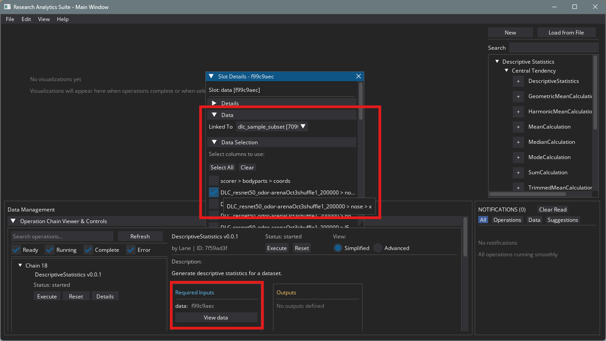   

   > *What just happened?* You linked the `data` input of the operation to a specific column in the `dlc_sample_subset` memory slot. This tells the operation which column of data to analyze when you execute it.
4. Click `Execute`.
5. Select `View Result` for the 'New Result' within the `Notifications` region. The Results window contains the variables generated by the executed operation. Each of the variables listed are saved within the `Memory Slots` region of the Data Management panel.

   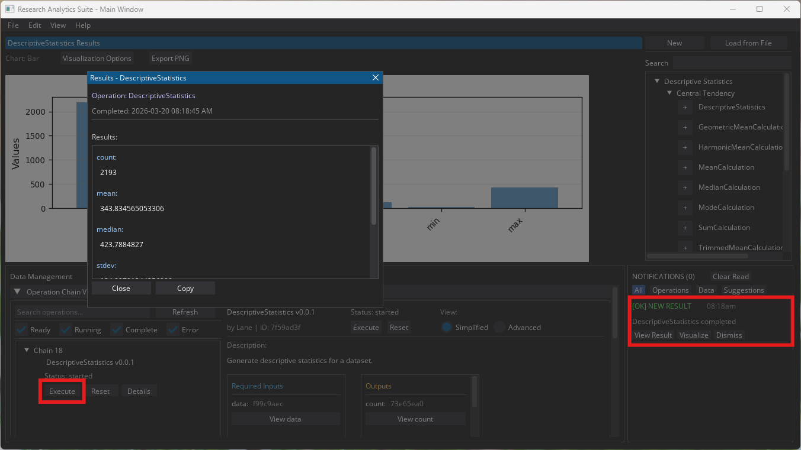 

   > **Note**: The `Memory Slots` region contains ALL variables generated by operations. You can inspect them, use them as inputs for other operations, or export them as needed. However, the region can quickly get cluttered with variables from multiple operations. To keep it organized, consider cleaning up by deleting variables that are no longer needed. <br>*Future versions of RAS will include features to help manage this (e.g., variable tagging, grouping, auto-cleanup options, etc.)*
   
   You should see output similar to:
   
   | Statistic | Value  |
   |-----------|--------|
   | Count     | 2,193  |
   | Mean      | 343.83 |
   | Median    | 423.79 |
   | Std Dev   | 124.90 |
   | Min       | 31.89  |
   | Max       | 432.00 |
   > The wide standard deviation (~125 px) reflects the full x-range of the arena (~400 px wide). Notice that the mean (~344 px) is substantially lower than the max (~432 px) and the median (~424 px). This gap hints at a skewed distribution: the mouse spent most of its time near the port but made excursions toward the far end, pulling the mean downward.

6. Repeat steps 1-5 with `nose_y` to characterize vertical movement. Output below for `nose_y`:

   | Statistic | Value  |
   |-----------|--------|
   | Count     | 2,193  |
   | Mean      | 108.10 |
   | Median    | 119.26 |
   | Std Dev   | 37.42  |
   | Min       | 15.77  |
   | Max       | 157.71 |
   > The y standard deviation (~37 px) is much smaller than x (~125 px). Here too the mean (108.10) sits below the median (119.26), consistent with the mouse spending most time near the port's y-coordinate (~120 px) with occasional movement to lower y values when it was far from the port.

---

### Quantile Distribution of Nose X Position

Descriptive statistics give a summary, but quantiles reveal the **shape** of the distribution -- particularly useful when data is skewed. Here the mean (343.83) is substantially lower than the median (423.79), which signals a strongly left-skewed distribution. Quantiles make this concrete.

1. In the Operation Library, locate **Quantile Calculation**.
   > You can find it under `Descriptive Statistics`, then `Distribution`, and finally click the `+` button next to `QuantileCalculation`.
2. Open the operation configuration panel by clicking the `Details` button.
3. Link the `numbers` input to `dlc_sample_subset` and select:
   - `DLC_resnet50_odor-arenaOct3shuffle1_200000 > nose > x`
4. For the `quantiles` input, specify the quantiles to calculate as a list:
   - In the `Data` region, select the dropdown `Type` and choose `list`.
   - In the `Value` field, enter: `[0.1, 0.25, 0.5, 0.75, 0.9, 0.95, 0.99]`
   - Select the `Set Value` button to confirm the quantiles.
   > This will calculate the 10th, 25th, 50th (median), 75th, 90th, 95th, and 99th percentiles of the nose x-position distribution.

   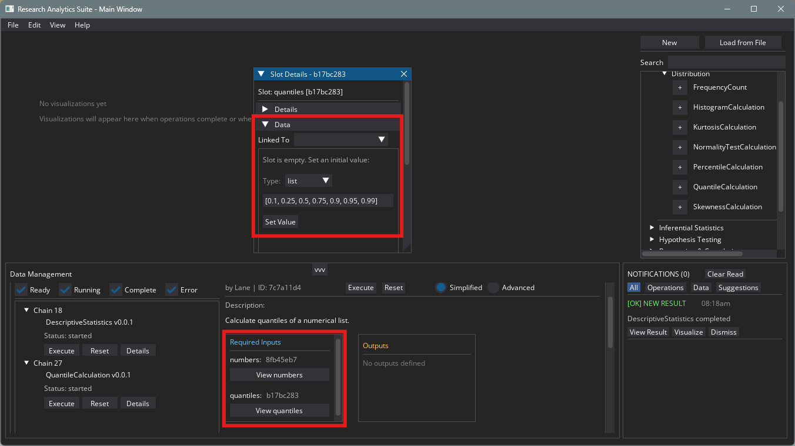 

5. Click **Execute**.

   Expected output:

   | Quantile | Nose X (px) |
   |----------|-------------|
   | p10      | 101.28      |
   | p25      | 257.52      |
   | p50      | 423.79      |
   | p75      | 431.30      |
   | p90      | 432.04      |
   | p95      | 432.27      |
   | p99      | 432.51      |

   > The p50 through p99 are all clustered near 423-433px -- the x-coordinate of the odor port (x = 433). This confirms the mouse spent the majority of this recording at the port. The wide gap between p25 (257px) and p50 (423px) reflects the rapid approach from the far end of the arena captured in the first half of the recording. The mean (343.83) is dragged well below the median by these lower-x frames, a classic signature of a left-skewed distribution.

---

### Spatial Coupling via Correlation Matrix

Rather than correlating all body-part x-positions (which are trivially correlated -- they all belong to the same animal), a more revealing correlation examines **how different spatial dimensions relate to each other**. Here we compare the nose x-position, nose y-position, and tailbase x-position.

1. In the Operation Library, add a **Correlation Matrix** operation to the `Operation Chain Viewer & Controls` panel.
   > You can find it under `Regression & Correlation`, then `Correlation Analysis`, and finally click the `+` button next to `CorrelationMatrix`.
2. Open the operation configuration panel by clicking the `Details` button.
3. Link the `data` input to `dlc_sample_subset` and select the following columns:
   - `DLC_resnet50_odor-arenaOct3shuffle1_200000 > nose > x`
   - `DLC_resnet50_odor-arenaOct3shuffle1_200000 > nose > y`
   - `DLC_resnet50_odor-arenaOct3shuffle1_200000 > tailbase > x`
4. Specify the `labels` for the correlation matrix as a list of strings:
   - In the `Data` region, select the dropdown `Type` and choose `list`.
   - In the `Value` field, enter: `["nose_x", "nose_y", "tailbase_x"]`
   - Select the `Set Value` button to confirm the labels.
5. Click **Execute**.

   Expected output (Pearson r):

   |            | nose_x | nose_y | tailbase_x |
   |------------|--------|--------|------------|
   | nose_x     | 1.000  | 0.783  | 0.976      |
   | nose_y     | 0.783  | 1.000  | 0.789      |
   | tailbase_x | 0.976  | 0.789  | 1.000      |

   > **nose_x vs tailbase_x (r = 0.976)**: The tail base closely tracks the nose in the horizontal dimension, confirming the body follows the head through the arena. <br>**nose_x vs nose_y (r = 0.783)**: This non-trivial coupling reveals the geometry of the approach: the odor port is located in a corner of the arena (~433px, ~120px). Moving toward it requires simultaneous increases in both x and y from the mouse's starting position in the opposite corner, creating a diagonal trajectory that couples the two axes. <br>**nose_y vs tailbase_x (r = 0.789)**: The same diagonal-approach geometry couples the y position of the nose to the x position of the body, reinforcing that this entire recording is a single directed approach event.

---

### Moving Average of Nose Trajectory

DLC tracking introduces frame-to-frame jitter even after likelihood filtering. Applying a **Moving Average** smooths this high-frequency noise to reveal the underlying locomotion pattern.

1. In the Operation Library, locate and load `Moving Average Calculation`.
2. Open the input configuration panel.
3. For `time_series`, select `DLC_resnet50_odor-arenaOct3shuffle1_200000_nose_x` from `dlc_sample_subset`.
4. Set the data type for `window_size` to `int` and set the value to `15` (equivalent to 0.5 seconds at 30 fps). Select the `Set Value` button to confirm.
5. Click **Execute**.

> The resulting visualization will be a histogram of the returned data; a histogram doesn't serve much purpose here, you can view it as a table by selecting `Visualization Options` and changing the `Chart Type` to `Text/Raw Data`. Then scroll to the bottom and select `Apply & Close` to refresh the visualization.

The result is a smoothed nose_x time series. A window of 15 frames is a reasonable starting point -- increase it (e.g., 30) for a coarser trend view, or decrease it (e.g., 5) to retain more of the rapid sniffing dynamics.

---

## Trajectory Visualization

Select the **`dlc_sample_subset`** memory slot. The Visualization Workspace (center panel) will auto-populate with a default chart. Switch to a **Scatter** chart to reveal the spatial trajectory:

1. In the Visualization Workspace, open **Visualization Options**.
2. Set **Chart Type**: `Scatter Plot`.
3. Update the chart title & axes:
   - Chart Title: `"CB3-3 Nose Trajectory"`
   - X-Axis Label: `"Nose X (px)"`
   - Y-Axis Label: `"Nose Y (px)"`
4. Set **X Column**: `DLC_resnet50_odor-arenaOct3shuffle1_200000_nose_x`.
5. Select **Y Column**: `DLC_resnet50_odor-arenaOct3shuffle1_200000_nose_y`.
6. Adjust **Display Options** as desired (e.g., market size, chart size, etc.).
7. Click `Apply & Close` at the bottom of the options window to render the scatter plot.
8. Visualization Export is discussed below in the [Export Results](#export-results) section.

   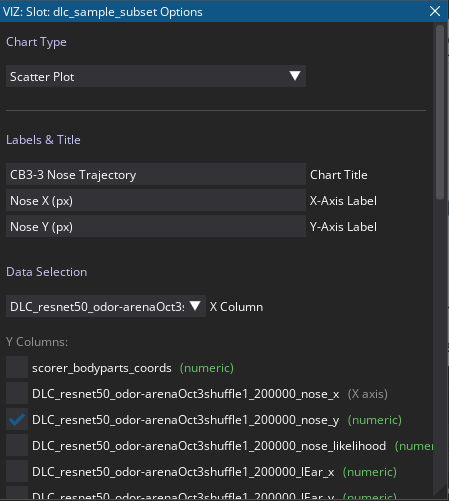

   > The scatter plot reveals the path the mouse took through the arena. Notice clustering near the odor port (located near [425, 120] for this trial) and along the walls, consistent with natural exploratory behavior.

   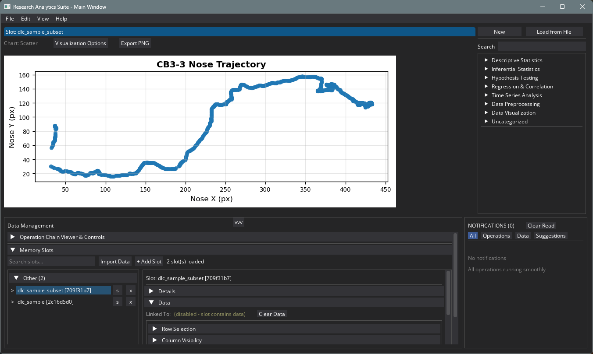

---

## Head Tracking Line Plot

To see how the mouse's head moved **over time**, switch to a Line chart:

1. In the Visualization Options, set **Chart Type**: `Line Chart`.
2. Update the chart title & axes:
   - Chart Title: `"CB3-3 Nose Position Over Time"`
   - X-Axis Label: `"Frame Index"`
   - Y-Axis Label: `"Nose Position (px)"`
3. Set **X Column**: `(Index)` (frame index).
4. Select **Y Columns**: 
   - `DLC_resnet50_odor-arenaOct3shuffle1_200000_nose_x`
   - `DLC_resnet50_odor-arenaOct3shuffle1_200000_nose_y`
5. `Apply & Close` to render the line chart.

   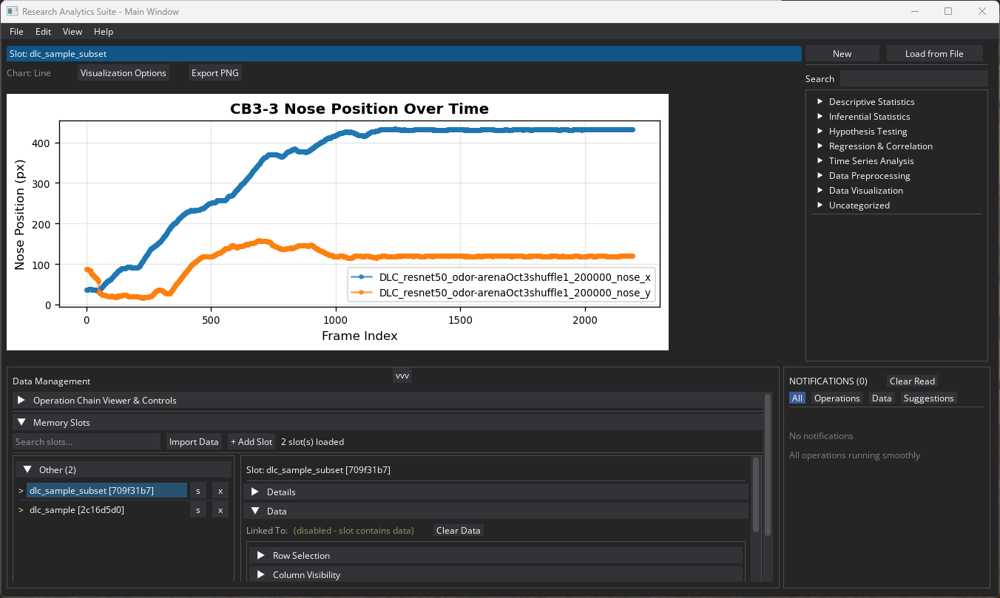

   > The line plot captures the temporal dynamics — rapid back-and-forth movements indicate active sniffing behavior near the port.

---

## Probability Density of Mouse Location (Heatmap)

A heatmap shows **where the mouse spent the most time** — the spatial probability density:

1. Set **Chart Type**: `Heatmap`.
2. Set **Labels & Title**: 
   - Chart Title: `"CB3-3 Nose Location Density"`
   - X-Axis Label: `"Nose X (px)"`
   - Y-Axis Label: `"Nose Y (px)"`
3. Set **X Axis** → `DLC_resnet50_odor-arenaOct3shuffle1_200000_nose_x`
4. Set **Y Axis** → `DLC_resnet50_odor-arenaOct3shuffle1_200000_nose_y`
5. Adjust **Display Options** (e.g., bin size, color map) as desired.
6. Click `Apply & Close` to render the heatmap.

   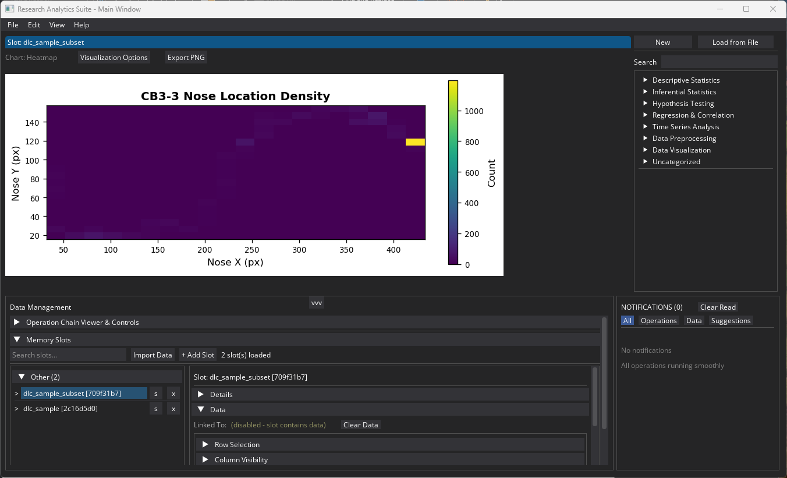

   > The hotspots (bright regions) correspond to areas where the mouse lingered — often near the odor port or arena walls.

   > **Note:** This example is a simple density estimate and is not ideal for publication-quality figures, but it serves to illustrate the concept of spatial probability density utilizing the sample dataset.

---

## Export Results

The `export` folder is located within the active workspace directory, which is where all exported files (PNGs, CSVs, etc.) will be saved by default. You can find it at:
> `~\Research-Analytics-Suite\workspaces\<active workspace>\export`

> **Note:** The default workspace directory is `default_workspace`. You can create and switch to custom workspaces using the `File` menu.

### Export a visualization as PNG

Within any active visualization tab, you can export the current chart as a PNG image:
1. Click `Export PNG` in the Visualization Options panel.
2. Image will be saved to your `export` folder within the active workspace directory.

### Export cleaned data as CSV or JSON

To save `dlc_sample_subset` as a CSV or JSON for use in other tools:
1. In the Data Management panel, select **`dlc_sample_subset`**.
2. Open the `Backup & Export` tab.
3. Click `Export CSV` or `Export JSON` as desired.
4. CSV or JSON will be saved to your `export` folder within the active workspace directory.

   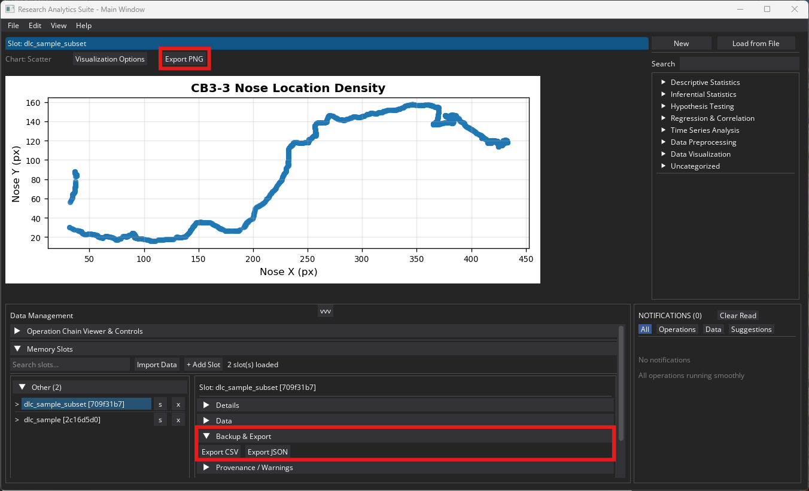

---

Beyond visualization, the **Operation Library** contains general-purpose analytics you can apply to DLC data or any other dataset. These include, but are not limited to:

| Category                 | Operations available                                                             |
|--------------------------|----------------------------------------------------------------------------------|
| Descriptive Statistics   | Mean, Median, Mode, Std Dev, Variance, Range, IQR, Quantile, Skewness, Kurtosis… |
| Inferential Statistics   | T-test, Paired T-test, Mann-Whitney U, Chi-Square…                               |
| ANOVA                    | One-way ANOVA                                                                    |
| Regression / Correlation | Linear Regression, Correlation Matrix, Covariance Matrix                         |
| Time Series              | Moving Average, Autocorrelation, Seasonal Decomposition                          |

---

## References

[^1]: Tariq MF, Sterrett SC, Moore S, Lane, Perkel DJ, Gire DH (2024) Dynamics of odor-source localization: Insights from real-time odor plume recordings and head-motion tracking in freely moving mice. *PLoS ONE* 19(9): e0310254. https://doi.org/10.1371/journal.pone.0310254

[^2]: Nath T, Mathis A, Chen AC, et al. (2019) Using DeepLabCut for 3D markerless pose estimation across species and behaviors. *Nature Protocols* 14, 2152–2176. https://doi.org/10.1038/s41596-019-0176-0
